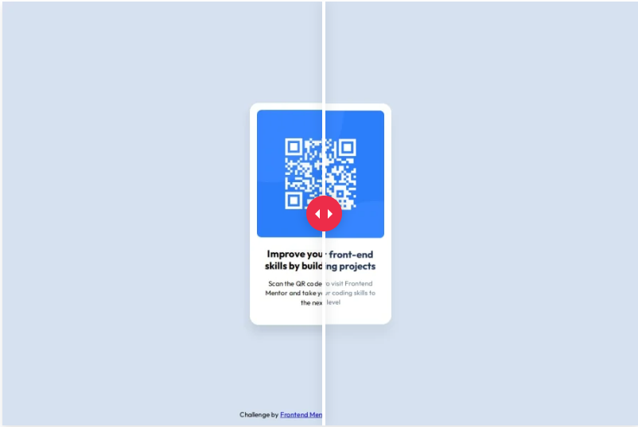

# Frontend Mentor - QR code component solution

This is a solution to the [QR code component challenge on Frontend Mentor](https://www.frontendmentor.io/challenges/qr-code-component-iux_sIO_H). Frontend Mentor challenges help you improve your coding skills by building realistic projects. 

## Table of contents

- [Overview](#overview)
  - [Screenshot](#screenshot)
  - [Links](#links)
- [My process](#my-process)
  - [Built with](#built-with)
  - [What I learned](#what-i-learned)
  - [Continued development](#continued-development)
  - [Useful resources](#useful-resources)
- [Author](#author)
- [Acknowledgments](#acknowledgments)

## Overview

### Screenshot

First trial

Second trial

### Links

- Solution URL: [https://github.com/ErwiniaDev/FrontendMentor_QrCodeComponent.git](https://github.com/ErwiniaDev/FrontendMentor_QrCodeComponent.git)
- Live Site URL: [https://erwiniadev.github.io/FrontendMentor_QrCodeComponent/](https://erwiniadev.github.io/FrontendMentor_QrCodeComponent/)

## My process

### Built with

- Semantic HTML5 markup
- CSS custom properties
- Flexbox

### What I learned

- rem unities / responsive
- HTML' structure details for accessibility
- Figma

### Continued development

I'd like to find a solution to avoid the position absolute/fixed for the footer.

### Useful resources

## Author

- Frontend Mentor - [@ErwiniaDev](https://www.frontendmentor.io/profile/ErwiniaDev)

## Acknowledgments

Thank you the Front-end Mentor community!
